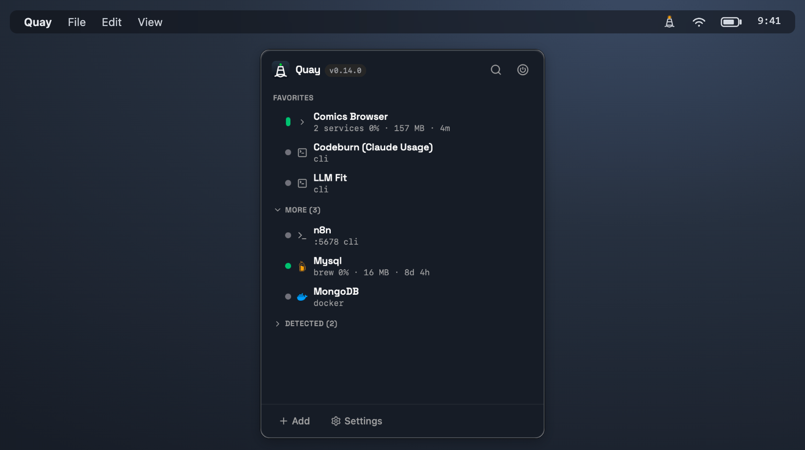

<div align="center">

<h1>Quay</h1>

> **Quay** _(pronounced "key")_ — **Where your ports come in.**
>
> A native macOS menubar app to start, stop, and monitor your local dev services — Node/Python servers, Homebrew services, Docker containers, and long-running terminal agents — from one place, with live CPU/memory metrics.

<a href="LICENSE"></a>
<a href="#requirements"></a>
<a href="https://tauri.app"></a>
<a href="https://abhi.am" target="_blank"></a>
<a href="https://github.com/sponsors/manustays"></a>

</div>


## The problem

If you build a lot of local services, you know the dance: remember which folder, `cd` into it, run the start command, switch to the browser, and repeat for every project. Keeping several running at once means juggling terminal tabs and trying to remember what's up and on which port.

**Quay** puts all of that one click away. Register an app folder once; then start it, see its live status, open its web UI, or drop into a terminal in its folder — straight from the menubar. It also manages Homebrew services (MySQL, MongoDB, Redis…), Docker containers, and long-running terminal agents.

<div align="center">

</div>


## Features

- **One unified list** for four kinds of long-running things:
  - **Project servers** — Node/Python apps on `localhost:<port>` (`npm run dev`, `python main.py`, …)
  - **Homebrew services** — `brew services` formulae like `mysql`, `mongodb-community`, `redis`
  - **Docker containers** — pick an image (autocompleted from your local images), name the container, and Quay starts the daemon if needed, then runs/reuses it
  - **Terminal agents** — interactive tools you run in a terminal (e.g. Claude Code, custom agents)
- **Start / stop** each item from the menubar. Background services run headless (no foreground terminal); their output is logged to a file.
- **Live status** — process liveness **plus** a port/HTTP health check, polled in the background and pushed to the UI (no manual refresh).
- **Resource metrics** — live CPU % and memory per item (including per-container `docker stats`), sampled while the popover is open.
- **Open in browser** — one click opens `http://localhost:<port>`.
- **Open a terminal** already `cd`'d into the service's folder, when you actually need to watch logs.
- **Auto-detect on add** — pick a folder and the app reads `package.json` / `requirements.txt` / `.env` to pre-fill the start command and port.
- **Port radar** — dev servers you started outside Quay show up in a **Detected** section (project name + framework icon), with one-click **adopt as service**, kill, or ignore. A stopped item whose port is taken by another process gets a ⚠ collision badge.
- **Agent radar** — terminal AI-agent sessions (Claude Code, Codex CLI, OpenCode, Pi) you started yourself show up in an **Agents** section with project name + stack icon, session name on hover, CPU/memory/uptime, and an active/idle dot; sessions in the same folder club into a project row with stacked agent badges. Reveal-in-Finder, kill, and ignore per session.
- **Tech-stack icons** — rows show the detected framework/runtime (Vite, Next, Django, Rails, Go, Rust, Docker, …) as a brand-colored icon.
- **Groups** — label related items (backend + frontend of one app) with a shared group; they cluster together with an aggregate status dot and start-all/stop-all.
- **Favorites + search** — pin the services you use most; the rest tuck under a collapsible "More".
- **Quality of life** — click a port to copy its `localhost` URL, per-row uptime, reveal-in-Finder, and crash errors that include the exit code + last log lines.
- **Per-item env vars, custom health path, and auto-start-on-launch.**
- **Configurable terminal** (Terminal.app or iTerm2) and **launch-at-login**.
- **Native & light** — built with Tauri v2 (Rust core + system webview), no bundled Chromium.

## Requirements

- **macOS** (Apple Silicon or Intel). This app is macOS-only — it uses `osascript`, `open`, and `brew`. The download is a **universal** build, so one `.dmg` runs natively on both architectures.
- For Homebrew items: [Homebrew](https://brew.sh) installed.
- For Docker items: [Docker Desktop](https://www.docker.com/products/docker-desktop/) installed (Quay can start the daemon for you, but it must be installed).
- To build from source: see [Development](docs/development.md).

## Download

**[⬇ Download for macOS — latest release](https://github.com/manustays/quay/releases/latest)**

Grab the `.dmg` from the latest release, open it, and drag **Quay** to `/Applications`.

> **First launch.** Current releases are **not yet code-signed/notarized**, so macOS Gatekeeper will say *"Quay can't be opened because it is from an unidentified developer."* This is expected. To open it:
> 1. Try to open Quay once (the warning appears).
> 2. Go to **System Settings → Privacy & Security**, scroll down, and click **Open Anyway** next to the Quay message, then confirm.
>
> (On macOS Sequoia and later, the older right-click → Open trick no longer reliably bypasses this for unsigned apps — use **Open Anyway**.) Full steps, plus the `xattr` alternative, are in the **[Installation guide](docs/installation.md)**.

### Build from source

Prefer to build it yourself (or want your own signed `.dmg`)?

```bash
git clone https://github.com/manustays/quay.git
cd quay
npm install
npm run tauri build      # produces a .app and .dmg under src-tauri/target/release/bundle/
```

Or run it in dev mode while you try it out:

```bash
npm run tauri dev
```

Full details, including the Rust/Node prerequisites and how to package, sign, and notarize a distributable build:

- **[Installation guide](docs/installation.md)**
- **[Packaging & distribution (macOS)](docs/packaging.md)**

## Usage

1. Click the menubar icon → **+ Add**.
2. **Pick a folder** (for a project or agent) — the app pre-fills name, start command, and port. Or choose **kind = brew** and pick a formula, or **kind = docker** and pick an image (Quay autocompletes from your local images and fills in a container name).
3. Tweak fields if needed (run mode, env vars, health path, favorite, auto-start) → **Save**.
4. Hit **▶** to start. Watch the dot go yellow → green. Use **↗** to open the browser, **>_** to open a terminal, **■** to stop.

See the **[Usage guide](docs/usage.md)** for the full walkthrough of item kinds, run modes, and status semantics.

## Documentation

| Doc | What's in it |
|-----|--------------|
| [Installation](docs/installation.md) | Prerequisites, build from source, install the `.app` |
| [Usage](docs/usage.md) | Adding items, run modes, status, browser/terminal actions, favorites |
| [Docker services](docs/docker-services.md) | Running and monitoring Docker containers as items |
| [Port radar](docs/port-radar.md) | How unmanaged listeners are discovered, adopted, killed, ignored |
| [Agent radar](docs/agent-radar.md) | How terminal AI-agent sessions are detected and what "active" means |
| [Metrics](docs/metrics.md) | How live CPU/memory sampling works (processes + `docker stats`) |
| [Configuration](docs/configuration.md) | `config.json` location + full field reference |
| [Packaging & distribution](docs/packaging.md) | Build a `.dmg`, code-sign, notarize, and the release CI |
| [Development](docs/development.md) | Dev setup, project layout, running tests |
| [Architecture](docs/architecture.md) | How the Rust core and webview fit together |
| [Troubleshooting](docs/troubleshooting.md) | Common issues and fixes |

## How it works (in one paragraph)

A Rust core owns all process supervision and state; a small vanilla-TypeScript webview is the popover UI. They talk over Tauri commands (UI → Rust) and events (Rust → UI). Background services are spawned as child processes in their own process group (so the whole tree can be stopped cleanly), with stdout/stderr written to a per-item log file. A background poll loop checks each item's process and port and pushes status changes to the UI. Everything dies with the app — quit from the tray's right-click **Quit** and owned children are terminated. See [Architecture](docs/architecture.md).

## Known limitations

- **macOS only.**
- **Services don't survive an app restart** by design — quitting the app stops everything it started; on relaunch all items show `stopped`.
- **Terminal-mode items are best-effort** — the app opens a Terminal/iTerm window but doesn't own that process; "stop" for those is best-effort, and a terminal item with a configured port can sit at `starting` if its window is closed externally.
- **Releases are not yet code-signed/notarized** — the download opens after an **Open Anyway** step (see [Download](#download)); a signed build removes that.


## Roadmap

- Hotkey to open the popover (currently only click the menubar icon)
- Per-item log viewer (currently you must open the log file in a terminal or editor)
- Per-item hotkey to start/stop (currently only click the row buttons)
- System notifications on status changes (currently only the dot and row color change)
- Configure the port radar's scan interval and ignored ports (currently hardcoded)
- Configure the menubar icon to show a badge with the number of running items (currently only the dot changes), or track a specific port's status (e.g. a backend service) and show its status in the menubar icon.
- Cross-platform support (Windows, Linux) — the Rust core is cross-platform, but the UI and process supervision are macOS-specific
- Signed & notarized releases (CI already publishes universal `.dmg`s — see [`.github/workflows/release.yml`](.github/workflows/release.yml))

## Support

Quay is an independent project I build and maintain in my spare time. The best way to support it is to use it, share feedback, report issues, or contribute.

If you find it useful and would also like to support my independent open-source work financially, [GitHub Sponsors](https://github.com/sponsors/manustays) is available.

## Contributing

Contributions welcome — see **[CONTRIBUTING.md](CONTRIBUTING.md)**. In short: open an issue to discuss, work on a `feature/`, `bugfix/`, or `chore/` branch, use conventional commits, run the tests (`cargo test` + `npm test`) and `npx tsc --noEmit` before opening a PR.

## License

[MIT](LICENSE) © 2026 [Kumar Abhishek](https://abhi.am)
